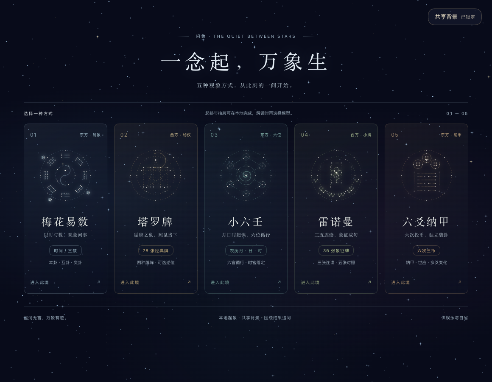
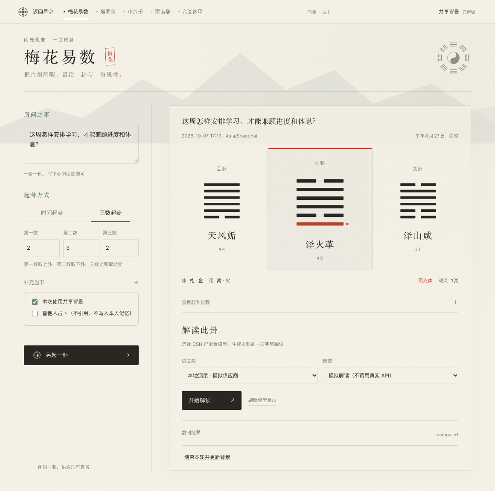
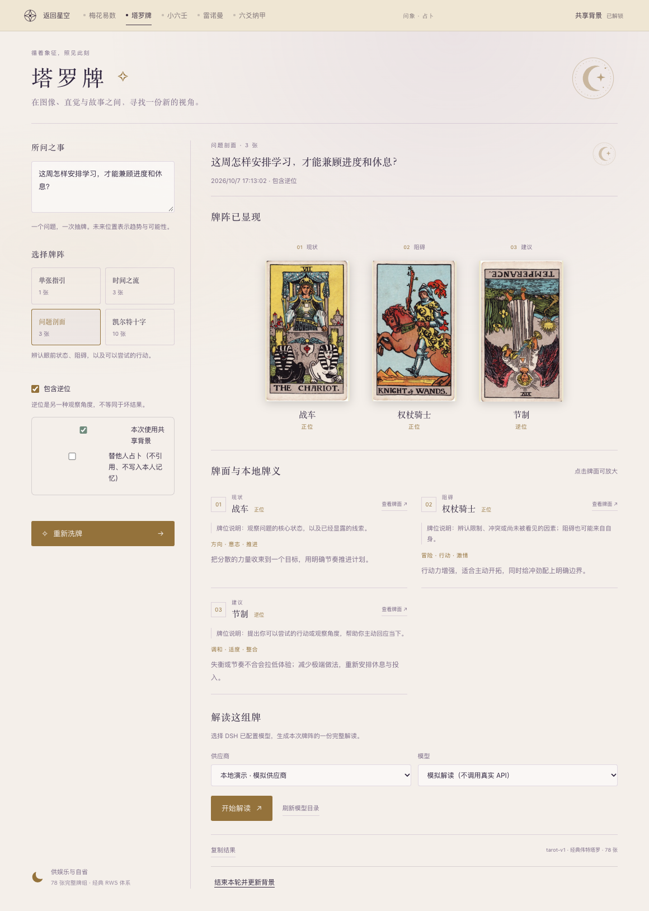
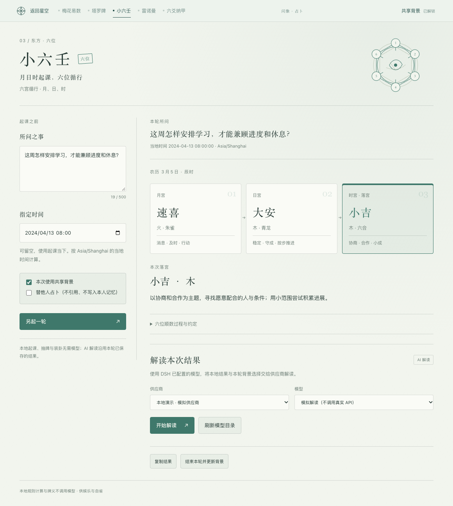
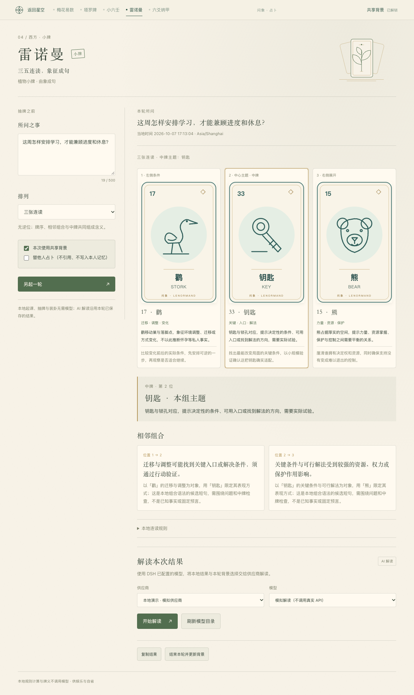
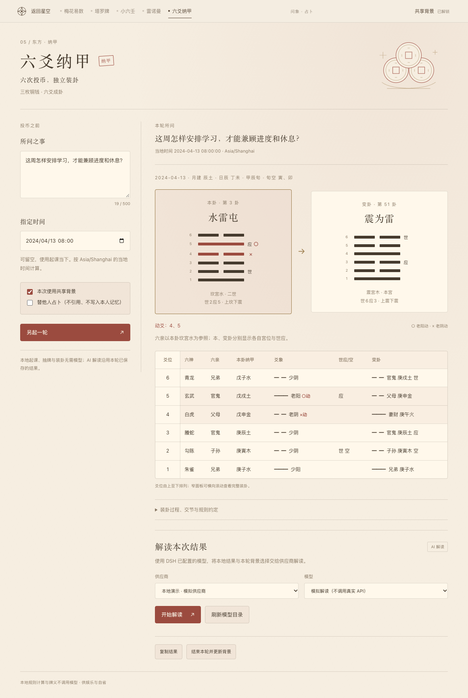
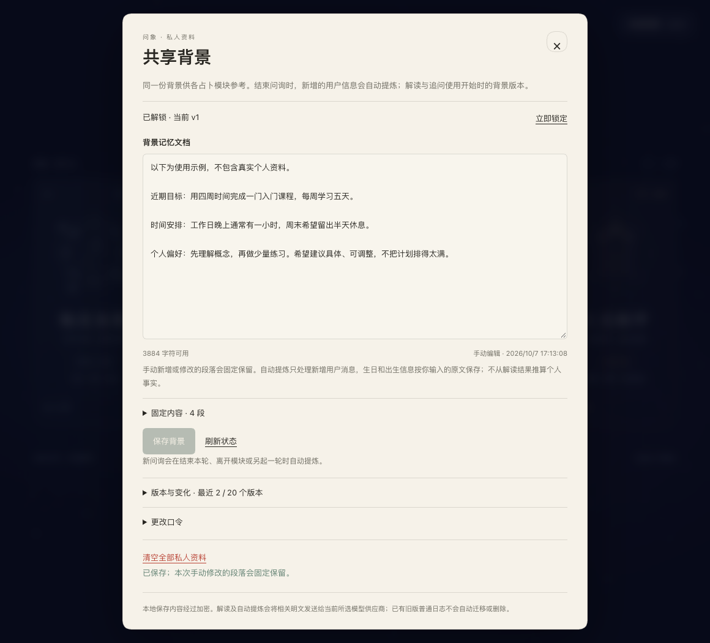

# 问象 · 占卜

**在 DeepSeek Harness 中起卦、抽牌，并围绕同一次结果继续交流。**

问象将梅花易数、塔罗牌、小六壬、雷诺曼和六爻纳甲放在同一个入口中。你可以先查看本地计算的卦象、牌阵和基础释义，再选择 DSH 中已配置的模型进行解读。五种方式共用一份可编辑、可撤回的背景文档，省去反复介绍近况的麻烦。

当前版本为 **0.6.0**，面向 **DeepSeek Harness 桌面端 0.2.0-rc.2**。本指南对应 2026 年 10 月 7 日的界面。插件包名仍为 `dsh-meihua`，供娱乐与自省使用。



*五个入口对应五套独立规则；右上角可以管理共享背景。下方截图均来自本地隔离预览，问题与背景为演示数据，未调用真实模型。*

## 阅读导航

- [安装与打开](#installation)
- [第一次使用](#quick-start)
- [五种方式怎么用](#methods)：[梅花易数](#meihua) · [塔罗牌](#tarot) · [小六壬](#xiaoliu) · [雷诺曼](#lenormand) · [六爻纳甲](#liuyao)
- [AI 解读与连续追问](#interpretation)
- [共享背景、版本与口令](#shared-background)
- [保存结果与切换页面](#saving)
- [常见问题](#faq)
- [规则、素材与开发资料](#references)

<a id="installation"></a>

## 安装与打开

### 安装前准备

准备好 DeepSeek Harness 和一个问象的 `.tgz` 安装包。当前前端优化包的文件名是 `dsh-meihua-0.6.0-frontend-20261007.tgz`，本地构建产物保存在 `artifacts/` 目录。安装包没有纳入 Git；如果你只有源码，请先按[开发指南](docs/development.md)构建和打包。

如果需要 AI 解读，还要先在 **DSH 设置中配置可用的供应商和模型**。问象直接使用宿主的模型配置，无需在插件里再次填写 API Key。只体验起卦、抽牌和本地释义时，可以暂不配置模型。

### 从桌面端安装

1. 在 DSH 左侧打开 **「插件」**，点击 **「添加插件」**。
2. 在安装来源中粘贴 `.tgz` 文件的**绝对路径**，按界面提示完成安装。
3. 确认插件已启用，然后从左侧打开 **「问象 · 占卜」**。
4. 在星空首页选择一种方式，进入对应页面。

这里的绝对路径是完整文件路径，例如 `/Users/你的用户名/Downloads/dsh-meihua-0.6.0-frontend-20261007.tgz`。请替换成自己电脑上的实际位置。

如果已经配置好 `dsh` 命令，也可以通过命令行安装：

```sh
dsh plugin add "/absolute/path/dsh-meihua-0.6.0-frontend-20261007.tgz" --profile desktop
```

安装后找不到入口时，先回到插件列表检查启用状态。已有较早版本的用户，可以用新包按同一流程更新；已经下载的旧安装包不会随源码自动变化。

<a id="quick-start"></a>

## 第一次使用

如果想快速熟悉操作，可以从 **梅花易数的三数起卦** 开始：

1. **需要 AI 解读时，先设置口令。** 打开右上角「共享背景」，输入并确认一个至少 8 字符的独立口令，点击「启用共享背景」。背景正文可以暂时留空。只看本地结果可跳过这一步。
2. **进入「梅花易数」并写下问题。** 例如：“这周怎样安排学习，才能兼顾进度和休息？”
3. **选择「三数起卦」**，依次输入 `2`、`3`、`2`，点击「起一卦」。动画可以跳过，不影响结果。
4. **先查看结果。** 右侧会显示本卦、互卦、变卦、动爻与体用关系；展开「查看起卦过程」可以核对计算。
5. **按需点击「开始解读」。** 向下找到解读区域，选择供应商和模型。首次回答结束后，可以在「继续聊聊这次解读」中发送追问。
6. **需要保留时，点击「复制结果」。** 将内容粘贴到自己的笔记中，再开始下一轮。

问题尽量包含一个具体主题和时间范围。例如“接下来两周如何推进求职准备？”比“我的未来怎么样？”更容易展开有针对性的交流。页面中的问题最多 500 字符；生日、处境和长期偏好可以另写在共享背景中。

**只想体验本地功能、不希望发生模型调用：保持共享背景未启用或已锁定即可。** 解锁后，除主动解读和追问外，结束本轮、离开模块或另起一轮也可能触发背景整理，详见[调用与费用](#model-calls)。

<a id="methods"></a>

## 五种方式怎么用

| 方式 | 需要做什么 | 能看到什么 | 可以从这里开始 |
| --- | --- | --- | --- |
| 梅花易数 | 使用当前时间、指定时间，或输入三个数字 | 本卦、互卦、变卦、动爻、体用和五行关系 | 想快速起一卦，并了解计算过程 |
| 塔罗牌 | 选择牌阵，从 78 张背牌中手动选牌 | 牌位、正逆位、完整牌面与本地牌义 | 想从图像和不同牌位梳理问题 |
| 小六壬 | 使用当前时间或指定时间 | 月宫、日宫、时宫与最终落宫释义 | 想用较简洁的结果观察当下 |
| 雷诺曼 | 从 36 张牌中选择三张或五张 | 中牌主题、相邻组合和镜像关系 | 想通过几个相连的象征整理线索 |
| 六爻纳甲 | 连续投币六次，或逐次录入实物投币的和值 | 本变卦、动爻、世应、纳甲、六亲、六神与旬空 | 想查看完整装卦信息 |

各模块顶部都可以返回星空首页或切换到其他方式。宽窗口下主要采用左右分栏，窄窗口会改为上下排列；解读和复制按钮可能需要向下滚动才能看到。界面配色会跟随 DSH 的浅色或深色主题。

<a id="meihua"></a>

### 梅花易数：按时间或三个数字起卦



*先查看三卦与动爻，再向下阅读计算过程或开始解读。*

1. 在「所问之事」中填写问题，需要时展开「补充当下」，补充地点、心情等信息。
2. 选择 **「时间起卦」** 或 **「三数起卦」**。时间起卦默认使用点击按钮的时刻，也可以勾选「指定时间」；三数起卦需要三个 `1—999,999,999` 之间的整数。
3. 点击 **「起一卦」**，等待动画结束，或直接跳过。
4. 阅读三卦、动爻及体用关系，展开 **「查看起卦过程」** 查看每一步依据。
5. 需要结合问题展开说明时，选择模型并点击 **「开始解读」**。要换一个问题时，点击 **「另起一卦」**。

不熟悉术语时，可以先这样理解：

| 页面上的名称 | 阅读时可以关注什么 |
| --- | --- |
| 本卦 | 本次起卦得到的主要卦象 |
| 互卦 | 从卦中间的爻组合出的另一层结构 |
| 变卦 | 动爻变化后形成的卦象 |
| 动爻 | 本次发生变化的那一爻，爻位从下往上数 |
| 体、用 | 本版用于分析关系的两个三爻卦；动爻所在的一方为“用”，另一方为“体” |

这些名称用于说明传统规则中的关系。AI 会结合固定结果解释其含义，问题文字和动画都不会改变计算结果。

<details>
<summary>查看本版的起卦约定</summary>

先天八卦序数固定为：乾 1、兑 2、离 3、震 4、巽 5、坎 6、艮 7、坤 8。除八余零按八，除六余零按六。

| 起卦方式 | 上卦 | 下卦 | 动爻 |
| --- | --- | --- | --- |
| 时间起卦 | 年支序数 + 农历月 + 农历日，除八取余 | 前述和 + 时支序数，除八取余 | 年支序数 + 农历月 + 农历日 + 时支序数，除六取余 |
| 三数起卦 | 第一数 A 除八取余 | 第二数 B 除八取余 | A + B + C 除六取余 |

年支和时支按子 1 至亥 12。默认时区为 `Asia/Shanghai`，按农历新年换年、当地零点换日；23:00 不提前换日。闰月使用同名月份的数字，支持公历 1900—2100 年的时间输入。

互卦下卦取二、三、四爻，上卦取三、四、五爻；纯乾、纯坤从变卦取互卦。变卦只翻转本次动爻。五行对应乾兑金、震巽木、坎水、离火、艮坤土。

</details>

<a id="tarot"></a>

### 塔罗牌：选牌阵，再亲手抽牌



*每张牌都有固定牌位；点击已揭示的牌可以放大查看。*

1. 填写问题，或留空作为当下指引。
2. 选择一个牌阵，并决定是否勾选 **「包含逆位」**。逆位默认开启，也可以关闭。
3. 点击 **「洗牌，开始抽取」**。洗牌结束后，从 78 张背牌中按顺序选择；左右滑动或点击箭头可以查看其余背牌。
4. 选满所需张数后，按提示逐张翻牌，或点击 **「全部揭示」**。
5. 查看每张牌的牌位说明、关键词和本地牌义。全部揭示后，可以开始 AI 解读。

| 牌阵 | 张数 | 牌位含义 |
| --- | --- | --- |
| 单张指引 | 1 | 聚焦当下的一个提示 |
| 时间之流 | 3 | 过去、现在、未来趋势 |
| 问题剖面 | 3 | 现状、阻碍、建议 |
| 凯尔特十字 | 10 | 现状、阻碍、目标与可能、基础、过去、近期发展、自身立场、环境影响、希望与恐惧、发展趋势 |

第一次使用可以选择「单张指引」或「问题剖面」。凯尔特十字的第 2 张牌横放是牌阵布局，是否逆位会单独标注；未来牌位表示趋势与可能性。

牌组包含 22 张大阿卡纳和 56 张小阿卡纳。洗牌时就会固定牌序和正逆位，你点击背牌的顺序决定它落在哪个牌位，同一轮不会抽到重复牌。**模型不参与抽牌。** 点击「重新洗牌」会替换本模块的当前牌阵和问答。

<a id="xiaoliu"></a>

### 小六壬：查看月、日、时三阶段落宫



*从左到右依次是月宫、日宫和时宫，以最后的时宫作为本次落宫。*

1. 写下问题；需要重现某个时刻时，填写 **「指定时间」**，留空则使用起课当下。
2. 点击 **「本地起课」**。
3. 查看月宫、日宫、时宫，以及下方的 **「本次落宫」** 和本地释义。
4. 展开 **「六位顺数过程与约定」**，核对农历日期、时辰和计数过程。需要进一步讨论时，再开始解读或追问。

六宫依次为大安、留连、速喜、赤口、小吉、空亡。本版按农历月、日、时顺数，闰月使用同名月份的数字，按当地零点换日。

可复现示例：在默认 `Asia/Shanghai` 时区输入 **2024-04-13 08:00**，对应农历三月初五辰时，结果为 **速喜 → 大安 → 小吉**。完整计数约定和对照样例见[小六壬规则](docs/g5-xiaoliu-rules.md)。

<a id="lenormand"></a>

### 雷诺曼：把相邻的牌连起来读



*先看中间一张牌的主题，再阅读相邻牌的组合说明。*

1. 写下问题，在「排列」中选择 **「三张连读」** 或 **「五张对照」**。
2. 点击 **「洗牌，开始抽取」**，从 36 张背牌中依次选择。选择顺序就是最后的排列顺序。
3. 选满后点击 **「揭示这组牌」**。
4. 先看 **「中牌」** 确定本组主题，再向下阅读 **「相邻组合」**。五张排列还会显示第 1 与第 5 张、第 2 与第 4 张的 **「镜像对照」**。
5. 展开 **「本地连读规则」** 查看说明，或选择模型进一步解读。

雷诺曼使用独立的 36 张小牌组，**没有逆位**，一轮中不会出现重复牌。本地牌义会同时显示象征、关键词和建议；组合按位置关系解释。规则与原创牌面说明见[雷诺曼规则](docs/g6-lenormand-rules.md)。

<a id="liuyao"></a>

### 六爻纳甲：投币六次，自下而上成卦



*输入顺序从初爻到上爻；成卦后，图和表按上爻在上的方式显示。*

1. 写下问题，按需填写 **「指定时间」**，然后点击 **「开始六次投币」**。
2. 每次点击 **「投掷三枚硬币」**，由插件模拟一次投币；也可以用实物投币，再点击对应的 **「记录 6」**、**「记录 7」**、**「记录 8」** 或 **「记录 9」**。
3. 连续记录六次：第一次是最下面的初爻，第六次是最上面的上爻。当前没有单步撤销，录入有误时需要另起一轮。
4. 六次记录完成后，查看本卦、变卦和动爻，继续向下阅读完整装卦表。窗口较窄时，表格可以横向滚动。
5. 要重新开始时，点击 **「另起一轮」**；需要文字说明时，再选择模型解读。

本版把硬币的**字面记为 2，背面记为 3**，每次三枚硬币相加：

| 三枚之和 | 名称 | 本卦中的爻 | 是否变化 |
| --- | --- | --- | --- |
| 6 | 老阴 | 阴爻 | 变为阳爻 |
| 7 | 少阳 | 阳爻 | 不变 |
| 8 | 少阴 | 阴爻 | 不变 |
| 9 | 老阳 | 阳爻 | 变为阴爻 |

六爻可以没有动爻，也可以有多个动爻；所有动爻共同形成变卦。装卦表包含纳甲、六亲、六神、世应和旬空。月建按节气交接时刻计算，日辰按当地零点换日，不做真太阳时修正。更详细的说明与人工例盘见[六爻纳甲规则](docs/g7-liuyao-rules.md)。

<a id="interpretation"></a>

## AI 解读与连续追问

### 开始一次解读

完成起卦或揭牌后，在结果下方选择 **「供应商」** 和 **「模型」**，点击 **「开始解读」**。如果按钮不可用，先检查结果是否完整、共享背景是否已解锁，以及模型列表是否有可选项。

**即使不引用背景正文，AI 解读也需要先设置并解锁独立口令。** 口令同时用于保护新版私人问询记录；背景文档本身可以留空。

AI 接收本次已经确定的卦象或牌阵，并结合问题展开解释。预设会先说明结果依据，再用日常语言解释术语，最后给出可以尝试的小行动。实际回答的详略和质量取决于所选模型。

每轮保留一份初始解读。生成中可以取消，已经收到的文字会保留；出错或超时后也不会自动重试。

### 围绕同一次结果继续聊

初始解读已输出文字并结束后，页面会出现 **「继续聊聊这次解读」**。例如可以问：

- “刚才提到的体用关系，能用日常例子解释吗？”
- “这个判断主要对应哪张牌、哪个牌位？”
- “如果我每天只有半小时，可以怎样调整你的建议？”

追问沿用**同一次结果、首次解读时选定的模型，以及当时的背景版本**。它不会重新起卦或抽牌，也不会把另一模块的结果混进来。补充新情况后，可以继续讨论；想换问题、牌阵或解读模型时，需要开始新一轮。

每条追问最多 **2000 字符**；完整上下文超过 **60000 字符** 时会提示无法继续，不会悄悄删掉前文。生成期间要先等待完成或取消，才能发送下一条或使用插件内导航。同一时刻，整个插件只进行一份初始解读或追问回答。

<a id="model-calls"></a>

### 哪些操作会调用模型？

| 操作 | 是否调用模型 |
| --- | --- |
| 打开页面、起卦、投币、选牌、翻牌、查看本地释义 | 这些操作本身不调用 |
| 点击「开始解读」、发送追问 | 会，使用你选定的供应商和模型 |
| 结束本轮、离开当前模块或另起一轮 | 有尚未整理的本人问询、背景已解锁且有可用模型时，可能调用模型更新背景 |
| 切到 DSH 的其他页面、刷新或重新打开插件页面 | 不因此触发背景整理 |
| 查看、手动修改或恢复背景版本 | 不调用 |

模型请求按供应商的规则计费。**没有点击「开始解读」，也不一定代表本轮完全没有模型调用**：满足条件时，离开模块也可能整理你写下的问题。取消「本次使用共享背景」只控制背景引用，不会关闭自动整理；[下一节](#background-options)说明了两项开关的区别。

<a id="shared-background"></a>

## 共享背景、版本与口令

共享背景是一份由五个模块共同使用的文字文档。适合记录你愿意提供的近况、目标、偏好和约束，避免每次提问都从头介绍。



*示例只记录学习安排和回答偏好。可以先写少量信息，之后再补充。*

### 设置与手动编辑

1. 从首页或任一模块右上角打开 **「共享背景」**。
2. 首次输入并确认至少 8 字符的口令，点击 **「启用共享背景」**。以后重启 DSH，需要再次输入口令解锁。
3. 在 **「背景记忆文档」** 中填写资料，点击 **「保存背景」**。文档最多 4000 字符，手动新增或修改的段落会固定保留。

可以参考下面的写法，再按自己的情况修改：

```text
近期目标：这两周想完成一门课程的复习。
时间安排：工作日晚上大约有半小时，周末可以多安排一些。
偏好与约束：希望建议具体、可执行，不想靠熬夜赶进度。
希望你记住：不清楚的情况请先问我，不要替我补全。
```

生日、出生时间和地点都可以按需填写，不清楚的内容直接写“不详”。这些文字作为解读背景使用，不会自动转换成八字或星盘。

<a id="background-options"></a>

### 两项开关有什么区别？

| 选项 | 本次解读是否引用本人背景 | 本轮问询是否参与自动背景整理 |
| --- | --- | --- |
| 勾选「本次使用共享背景」 | 是 | 符合更新条件时参与 |
| 取消「本次使用共享背景」 | 否 | 仍可能参与 |
| 勾选「替他人占卜」 | 否 | 不写入本人记忆 |

替朋友询问时，请在**起卦或抽牌前**勾选 **「替他人占卜（不引用、不写入本人记忆）」**。这样即使本轮只查看本地结果，也能避免把朋友的问题整理进自己的背景。首次解读开始后，背景选择和版本会固定下来，本轮追问继续沿用。之后修改共享背景，只会影响下一次新解读。

### 自动更新和撤回

点击 **「结束本轮并更新背景」**、离开当前模块或另起一轮时，插件会尝试从尚未整理的用户问题和追问中提取新增信息。它使用本次选定的模型；没有新增消息时不会调用。没有可用模型时，更新保持待处理。

整理只以你输入的内容为依据，不把 AI 的预测当作个人事实。失败、取消、内容不合格或遇到较新的手动修改时，保留原背景，不自动重试；之后可以再次点击「结束本轮并更新背景」。**这个按钮只更新背景，不会删除当前结果或另起一轮。**

想查看或撤回一次更新：

1. 打开「共享背景」，展开 **「版本与变化」**。
2. 选择一个版本，对照 **「更新前」** 与 **「更新后」** 的内容。
3. 点击 **「恢复这个版本」**。如有未保存的手动修改，先处理这些修改。

系统保留最近 **20 个版本**。恢复旧版本会生成一个新版本，已经整理过的消息不会在下一次结束时再次写回。后台正在更新时，新的 AI 解读会等待更新结束，再读取最新成功保存的版本。

### 锁定、口令和本地资料

点击 **「立即锁定」** 会取消私人内容生成，并清空五个模块的当前会话、草稿和解密缓存。需要保留的结果请先复制。锁定后仍可重新起卦、抽牌和查看本地释义，AI 解读及背景更新需要解锁。

背景、历史版本和新版私人问询记录以 **AES-256-GCM** 加密保存在本地。**本地加密不等于 AI 离线运行**：解读或自动整理时，相关明文仍会发给所选模型供应商。

- **更改口令：** 在面板内展开「更改口令」，输入当前口令和新口令。
- **忘记口令：** 无法恢复已加密的资料，请妥善保管。
- **清空资料：** 在解锁状态下点击「清空全部私人资料」，再确认。它会删除背景、版本及关联的新版加密问询记录，清空当前会话，且不能撤回；已有口令仍保留。

旧版已经写入的普通 DSH 日志不会自动迁移或删除。当前版本没有云同步、多人物档案或完整的占卜历史列表。

<a id="saving"></a>

## 保存结果与切换页面

在结果区域点击 **「复制结果」**，可以把本次卦象或牌阵、已有解读和追问内容复制出来，再粘贴到笔记软件中保存。小六壬、雷诺曼和六爻的复制内容还包括本轮背景使用信息；复制不会包含共享背景正文或尚未揭示的隐藏牌组。

| 发生的操作 | 当前内容会怎样？ |
| --- | --- |
| 在五个模块之间切换，或返回星空首页 | 各模块保留各自的当前进度；离开模块可能触发背景整理 |
| 切换到 DSH 其他页面，再回到插件 | 当前结果和生成状态可以恢复 |
| 刷新或重新打开客户端页面 | 可从正在运行的宿主恢复结果和已提交问答；未提交草稿不要当作已保存内容 |
| 另起一卦、重新洗牌或另起一轮 | 替换对应模块的当前结果和问答 |
| 立即锁定或清空私人资料 | 清空五个模块的当前会话和草稿 |
| 完全退出并重启 DSH | 当前卦象、牌阵和对话从空状态开始；加密背景及其版本仍保留，需要重新解锁 |

**加密保存问询记录，不代表已经提供历史回看功能。** 想长期留存某次结果，请在重新开始、锁定或退出前复制保存。

<a id="faq"></a>

## 常见问题

### “开始解读”为什么是灰色的？

依次检查：本地结果是否已完成；塔罗或雷诺曼是否已揭完牌；六爻是否已记录六次；共享背景是否已解锁；是否选中了可用的供应商和模型。另一个模块正在生成回答时，也需要先等待或取消。

### 列表里没有供应商或模型怎么办？

先在 DSH 设置中完成供应商配置，再回到插件点击「刷新模型目录」。出现认证、额度或限流提示时，应检查所选供应商的配置和账户状态。

### 为什么改了背景，当前追问还是沿用旧信息？

本轮首次解读会固定当时的背景版本，让整段对话保持一致。你可以在追问里补充情况；要让完整的新背景作为解读依据，请开始新一轮。

### 不想让朋友的问题写进我的背景，应该怎么做？

在起卦或抽牌前勾选「替他人占卜」。仅取消「本次使用共享背景」还不够：它只控制是否引用背景，不关闭本人问询的自动整理。

### 解读失败或取消后，还能继续吗？

已经收到的文字会保留。有文字且生成已结束时，可以围绕当前结果继续追问。如果页面已显示解读失败或取消，且没有任何输出，请先处理错误，再开始新一轮；如果请求尚未开始，只是提示模型配置有误，可以修正配置后对当前结果再次点击「开始解读」。当前没有“重新生成初始解读”按钮，也不会自动重试。

### 为什么不能立刻切换到另一个模块？

AI 正在生成时，插件内导航会暂时锁定。点击「取消解读」或「取消本轮回答」，等页面确认结束后即可切换。宿主自己的页面导航不受这项限制。

### 日期按哪个时区计算？

默认使用 `Asia/Shanghai`，界面会显示当前配置。指定时间输入框中的日期和时刻按**配置时区的当地时间**解释。梅花和小六壬使用农历月日，六爻月建则使用节气；采用不同规则的其他工具可能得到不同结果。

### 复制失败、表格看不全或动画不方便怎么办？

复制失败时可以直接选中文字手动复制。窄窗口下向下滚动寻找结果，六爻完整表格可以横向滚动，塔罗背牌可以左右滑动。起卦、洗牌和门户转场可以跳过；系统开启减少动态效果时，插件会使用简化动画。

### 能使用抽签、八字、占星、奇门或卢恩吗？

当前可用入口只有上面介绍的五种。仓库中的关帝灵签内容包和其他体系的研究、需求文档用于后续开发，尚未成为可用功能。

<a id="references"></a>

## 规则、素材与开发资料

想运行源码、修改提示词、调整默认配置或接入扩展规则，请阅读 **[开发指南](docs/development.md)**。其中保留了本地预览、构建打包、测试、RPC、加密实现和扩展示例，日常使用无需配置这些接口。

| 资料 | 内容 |
| --- | --- |
| [小六壬规则](docs/g5-xiaoliu-rules.md) | 六宫顺数、日界和闰月约定、可复现例子 |
| [雷诺曼规则](docs/g6-lenormand-rules.md) | 三张与五张连读、相邻组合、素材说明 |
| [六爻纳甲规则](docs/g7-liuyao-rules.md) | 三币取值、纳甲世应、节气与人工例盘 |
| [模块接入说明](docs/g4-module-framework.md) | 独立规则与公共能力的组织方式 |
| [0.6 验收记录](docs/v6-goal-completion-audit.md) | 当时的测试、隔离预览及验证范围 |
| [开发路线图](docs/roadmap.md) | 已交付内容与后续计划 |
| [截图说明](docs/images/README.md) | 本指南配图的来源与演示范围 |

塔罗使用历史 Rider–Waite–Smith 牌面，本地保存逐张来源与公有领域声明，详见[塔罗素材说明](src/assets/tarot/README.md)。雷诺曼的 36 张 SVG 牌面及中文释义由本项目编写。牌面在本地加载，插件不请求远程图片或字体。代码采用 [MIT 许可证](LICENSE)，第三方素材和依赖的许可分别记录在对应说明中。

验收中的模拟供应商只用于检查交互和流程，其输出不代表真实模型的解读质量。
